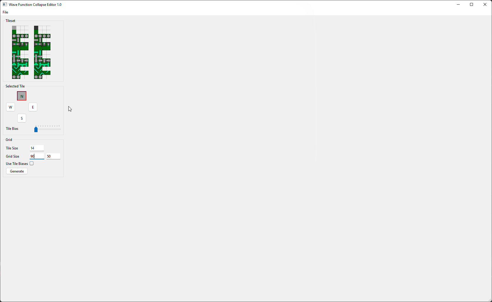

# Wave Function Collapse

This is a simple C++17 implementation of the Wave Function Collapse algorithm including a rudementary test UI.<br>
It does not contain any extensions such as overlapped WFC.

The WFC code is not tied to the UI code and can be easily recycled in other projects.


# Demo




# Code Usage

```cpp

// set up your tiles and how they are compatible to each other first
std::vector<Tile> tiles;

// configure a grid
Grid grid(64, 64, tiles);

// set up a callback if you want to see in realtime which slots in your grid are collapsed
grid._tile_collapsed_callback = [](const Vector2D& pos, int32_t index)
{
    // ...
};

// start the execution, ideally do this in another thread
grid.run();

// read the grid data and pass it to your UI
ui->_tile_grid->setGrid(grid._size, grid.readGrid());
```


# UI Usage

1. Load a texture
2. Select a tile on the left tileset
3. Select a direction (N, E, S, W) where you want to configure compatible tiles
4. Select compatible tiles on the right tileset
5. Repeat steps 2-4 until you've configured all your tile dependencies
6. Select a grid size
7. Hit 'Generate'

